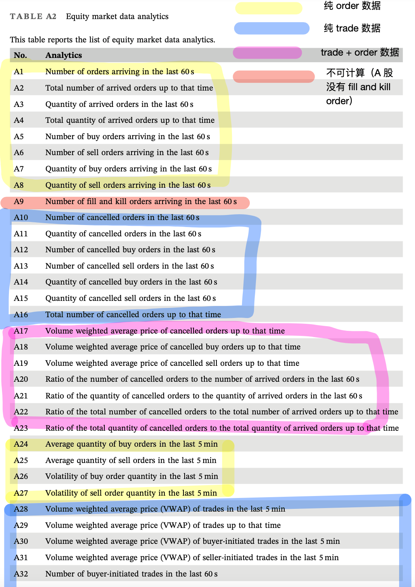
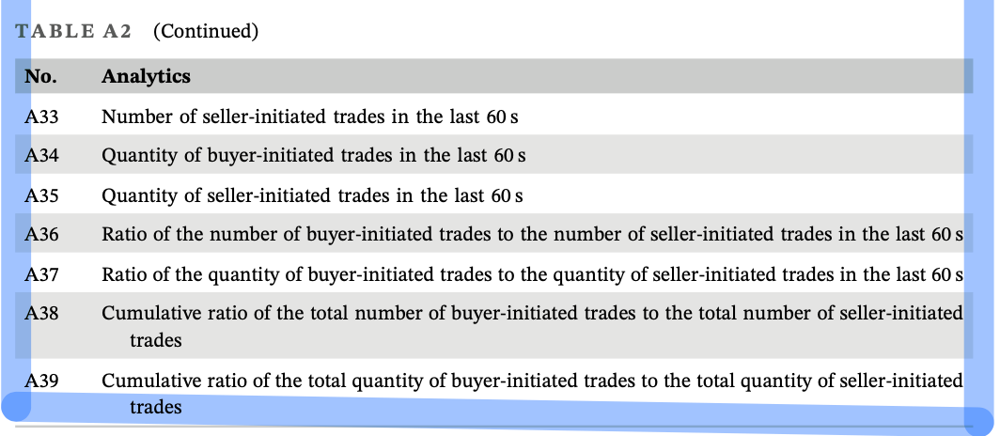
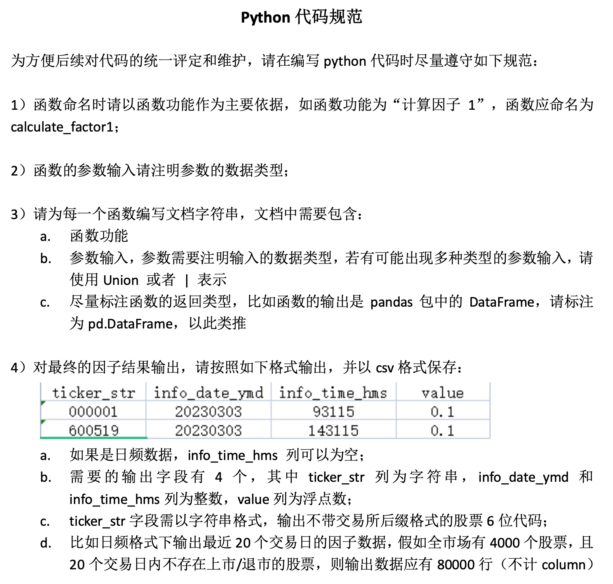
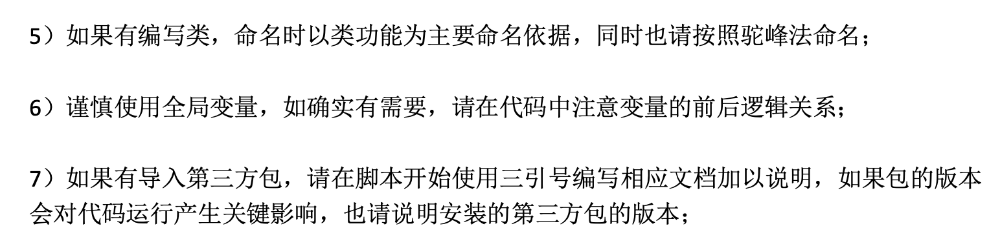

# 基于逐笔委托和逐笔成交数据构造高频因子

量化投资策略设计与分析的第一次作业是基于逐笔数据构造 39 个高频因子。我对高频因子的构造经验比较少，完成这个作业后的一些经验：

1. 高频因子的数据格式是比较标准化的，但也要注意细节：例如空缺时间的填补等。
2. 构造因子的过程本质上是数据处理的过程，常用的方法有：`groupby`、`resample`、`to_datetime`、`reindex`、`rolling`、`apply`等。如果是非常大的数据集，应当用 `numpy` 等更快速的科学计算包，或者用`C++`。

## 39 个因子表达式

用提供的某支证券为期不超过一周的高频数据复制 Table A2 中 39 种指标。



<!-- more -->



## 代码规范要求





## 计算因子的代码

自动更新类和函数中的代码更新，便于调试

```python
%load_ext autoreload
%autoreload 2
```

导入类和函数

```python
from functions import *
```

创建因子生成器的实例 factor_calculator

```python
factor_calculator = FactorCalculator(
    order_path="./data/order_stkhf202101_000001sz.csv",
    trade_path="./data/trade_stkhf202101_000001sz.csv",
    factors_index_path="./factors/factors_index.csv",
)
```

计算所有因子，并分别导出为 csv 文件

```python
# 初始化所有因子
factors = None
# 逐个计算因子，并保存到本地文件，同时将所有因子合并到 factors 这个 DataFrame 中
for i in tqdm(range(1, 39 + 1)):
    # 由于中国股市没有 fill and kill 数据，因此跳过 A9
    if i == 9:
        continue
    Ai = eval("factor_calculator.calculate_A" + str(i))()
    # 保存单个因子到本地文件
    Ai.to_csv("./factors/A" + str(i) + ".csv", index=False)
    # 将单个因子添加到所有因子中
    if factors is None:
        factors = Ai
    else:
        factors["A" + str(i)] = Ai["A" + str(i)]
```

    100%|██████████| 39/39 [00:12<00:00,  3.05it/s]

将所有因子导出为一个 csv 文件

```python
# 将所有因子的 index 转换为 datetime 类型
factors.index = pd.to_datetime(
    factors["info_date_ymd"].astype(str) + " " + factors["info_time_hms"].astype(str),
    format="%Y%m%d %H%M%S",
)
# 保留 9:30-11:30, 13:00-15:00 的数据，即删除 9:15-9:25 的数据
idx1 = factors.index.indexer_between_time("9:30", "11:30")
idx2 = factors.index.indexer_between_time("13:00", "15:00")
factors = factors.iloc[np.union1d(idx1, idx2)]
# 重置索引
factors = factors.reset_index(drop=True)
# 将所有因子保存到本地文件
factors.to_csv("./factors/all_factors.csv", index=False)
```

## 构造因子的函数

由于代码太长，这里只放了前 5 个因子的函数，完整代码见 [GitHub](https://github.com/jeremy-feng/high-frequency-factors/blob/main/functions.py)。

```python
"""
Author: Chao Feng
Date: 2023-03-14
Description: Functions for calculating high frequency factors

Requirements:
pandas
numpy
os
tqdm
"""

import pandas as pd
import numpy as np
import os
from tqdm import tqdm

class FactorCalculator:
    def __init__(
        self,
        order_path: str,
        trade_path: str,
        factors_index_path: str,
    ) -> None:
        """

        Parameters
        ----------
        order_path : str
            Path of order data
        trade_path : str
            Path of trade data
        factors_index_path : str
            Path of factors index

        """
        self.order_path = order_path
        self.trade_path = trade_path
        self.factors_index_path = factors_index_path
        # 读取 order 数据
        self.order = pd.read_csv(
            self.order_path,
            dtype={
                "Exchflg": "int",
                "Code": "string",
                "Code_Mkt": "string",
                "Qdate": "string",
                "Qtime": "string",
                "SetNo": "int",
                "OrderRecNo": "int",
                "OrderPr": "float",
                "OrderVol": "float",
                "OrderKind": "string",
                "FunctionCode": "string",
            },
        )
        # 读取 trade 数据
        self.trade = pd.read_csv(
            "./data/trade_stkhf202101_000001sz.csv",
            dtype={
                "Exchflg": "int",
                "Code": "string",
                "Code_Mkt": "string",
                "Qdate": "string",
                "Qtime": "string",
                "SetNo": "int",
                "RecNo": "int",
                "BuyOrderRecNo": "int",
                "SellOrderRecNo": "int",
                "Tprice": "float",
                "Tvolume": "float",
                "Tsum": "float",
                "Tvolume_accu": "float",
                "OrderKind": "string",
                "FunctionCode": "string",
                "Trdirec": "string",
            },
        )
        # 如果存在所有因子的数据文件，则读取因子数据
        if os.path.exists(self.factors_index_path):
            self.factors_index = pd.read_csv(self.factors_index_path)
            self.factors_index = self.factors_index.set_index(
                ["Code_Mkt", "Qdate", "Qtime"]
            )
        else:
            raise FileNotFoundError("Please provide the path of factors index.")

    def format_factor(self, data: pd.DataFrame) -> pd.DataFrame:
        """
        Format columns

        Parameters
        ----------
        data : pd.DataFrame
            Data

        Returns
        -------
        pd.DataFrame
            Data with formatted columns
        """
        # Reset index
        data = data.reset_index()
        # Rename columns
        data.rename(
            columns={
                "Code_Mkt": "ticker_str",
                "Qdate": "info_date_ymd",
                "Qtime": "info_time_hms",
            },
            inplace=True,
        )
        # Change data type
        data["ticker_str"] = data["ticker_str"].apply(lambda x: x.split(".")[0])
        data["info_date_ymd"] = data["info_date_ymd"].apply(
            lambda x: int(x.replace("-", ""))
        )
        data["info_time_hms"] = data["info_time_hms"].apply(
            lambda x: int(x.replace(":", ""))
        )
        return data

    def calculate_A1(self, data: pd.DataFrame = None) -> pd.DataFrame:
        """
        Number of orders arriving in the last 60 s

        Parameters
        ----------
        data : pd.DataFrame
            Order data

        Returns
        -------
        pd.DataFrame
            Number of orders arriving in the last 60 s
        """
        # 默认使用 self.order，如果指定了 data，则使用 data 中的数据
        if data is None:
            data = self.order
        # 按照股票、日期和秒钟分组。在组内，计算每秒的 order 数量
        factor = data.groupby(["Code_Mkt", "Qdate", "Qtime"])["OrderRecNo"].count()
        # 对比 factor_index，填补缺失值为 0
        factor = factor.reindex(self.factors_index.index, fill_value=0)
        # 按照股票和日期分组。在组内，对于每一秒，计算过去 60 秒的 order 数量之和
        factor = (
            factor.groupby(by=["Code_Mkt", "Qdate"])
            .rolling(60)
            .sum()
            .droplevel(level=[0, 1])
        )
        # 整理格式
        factor = self.format_factor(factor)
        factor.rename(
            columns={
                "OrderRecNo": "A1",
            },
            inplace=True,
        )
        factor["A1"] = factor["A1"].astype(float)
        return factor

    def calculate_A2(self, data: pd.DataFrame = None) -> pd.DataFrame:
        """
        Total number of arrived orders up to that time

        Parameters
        ----------
        data : pd.DataFrame
            Order data

        Returns
        -------
        pd.DataFrame
            Total number of arrived orders up to that time
        """
        # 默认使用 self.order，如果指定了 data，则使用 data 中的数据
        if data is None:
            data = self.order
        # 按照股票、日期和秒钟分组。在组内，计算每秒的 order 数量
        factor = data.groupby(["Code_Mkt", "Qdate", "Qtime"])["OrderRecNo"].count()
        # 对比 factor_index，填补缺失值为 0
        factor = factor.reindex(self.factors_index.index, fill_value=0)
        # 按照股票和日期分组。在组内，对于每一秒，计算当前累积的 order 数量之和
        factor = factor.groupby(by=["Code_Mkt", "Qdate"]).cumsum()
        # 整理格式
        factor = self.format_factor(factor)
        factor.rename(
            columns={
                "OrderRecNo": "A2",
            },
            inplace=True,
        )
        factor["A2"] = factor["A2"].astype(float)
        return factor

    def calculate_A3(self, data: pd.DataFrame = None) -> pd.DataFrame:
        """
        Quantity of arrived orders in the last 60 s

        Parameters
        ----------
        data : pd.DataFrame
            Order data

        Returns
        -------
        pd.DataFrame
            Quantity of arrived orders in the last 60 s
        """
        # 默认使用 self.order，如果指定了 data，则使用 data 中的数据
        if data is None:
            data = self.order
        # 按照股票、日期和秒钟分组。在组内，计算每秒的 OrderVol 之和
        factor = data.groupby(["Code_Mkt", "Qdate", "Qtime"])["OrderVol"].sum()
        # 对比 factor_index，填补缺失值为 0
        factor = factor.reindex(self.factors_index.index, fill_value=0)
        # 按照股票和日期分组。在组内，对于每一秒，计算过去 60 秒的 OrderVol 之和
        factor = (
            factor.groupby(by=["Code_Mkt", "Qdate"])
            .rolling(60)
            .sum()
            .droplevel(level=[0, 1])
        )
        # 整理格式
        factor = self.format_factor(factor)
        factor.rename(
            columns={
                "OrderVol": "A3",
            },
            inplace=True,
        )
        factor["A3"] = factor["A3"].astype(float)
        return factor

    def calculate_A4(self, data: pd.DataFrame = None) -> pd.DataFrame:
        """
        Total quantity of arrived orders up to that time

        Parameters
        ----------
        data : pd.DataFrame
            Order data

        Returns
        -------
        pd.DataFrame
            Total quantity of arrived orders up to that time
        """
        # 默认使用 self.order，如果指定了 data，则使用 data 中的数据
        if data is None:
            data = self.order
        # 按照股票、日期和秒钟分组。在组内，计算每秒的 OrderVol 之和
        factor = data.groupby(["Code_Mkt", "Qdate", "Qtime"])["OrderVol"].sum()
        # 对比 factor_index，填补缺失值为 0
        factor = factor.reindex(self.factors_index.index, fill_value=0)
        # 按照股票和日期分组。在组内，对于每一秒，计算当前累积的 OrderVol 之和之和
        factor = factor.groupby(by=["Code_Mkt", "Qdate"]).cumsum()
        # 整理格式
        factor = self.format_factor(factor)
        factor.rename(
            columns={
                "OrderVol": "A4",
            },
            inplace=True,
        )
        factor["A4"] = factor["A4"].astype(float)
        return factor

    def calculate_A5(self, data: pd.DataFrame = None) -> pd.DataFrame:
        """
        Number of buy orders arriving in the last 60 s

        Parameters
        ----------
        data : pd.DataFrame
            Order data

        Returns
        -------
        pd.DataFrame
            Number of buy orders arriving in the last 60 s
        """
        # 默认使用 self.order，如果指定了 data，则使用 data 中的数据
        if data is None:
            data = self.order
        # 筛选出 buy orders
        data = data[data["FunctionCode"] == "1"]
        # 按照股票、日期和秒钟分组。在组内，计算每秒的 order 数量
        factor = data.groupby(["Code_Mkt", "Qdate", "Qtime"])["OrderRecNo"].count()
        # 对比 factor_index，填补缺失值为 0
        factor = factor.reindex(self.factors_index.index, fill_value=0)
        # 按照股票和日期分组。在组内，对于每一秒，计算过去 60 秒的 order 数量之和
        factor = (
            factor.groupby(by=["Code_Mkt", "Qdate"])
            .rolling(60)
            .sum()
            .droplevel(level=[0, 1])
        )
        # 整理格式
        factor = self.format_factor(factor)
        factor.rename(
            columns={
                "OrderRecNo": "A5",
            },
            inplace=True,
        )
        factor["A5"] = factor["A5"].astype(float)
        return factor
```
